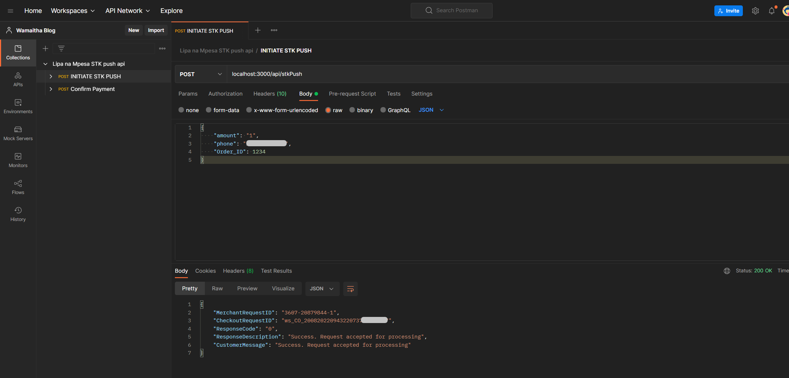
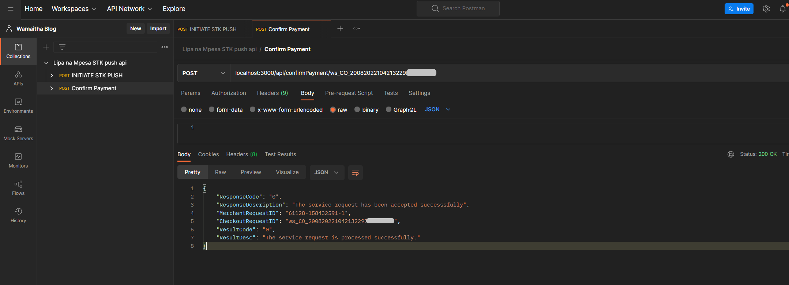

<div id="top"></div>
<!--
*** Thanks for checking out the Best-README-Template. If you have a suggestion
*** that would make this better, please fork the repo and create a pull request
*** or simply open an issue with the tag "enhancement".
*** Don't forget to give the project a star!
*** Thanks again! Now go create something AMAZING! :D
-->


<!-- PROJECT SHIELDS -->
<!--
*** I'm using markdown "reference style" links for readability.
*** Reference links are enclosed in brackets [ ] instead of parentheses ( ).
*** See the bottom of this document for the declaration of the reference variables
*** for contributors-url, forks-url, etc. This is an optional, concise syntax you may use.
*** https://www.markdownguide.org/basic-syntax/#reference-style-links
-->
[![Contributors][contributors-shield]][contributors-url]
[![Forks][forks-shield]][forks-url]
[![Stargazers][stars-shield]][stars-url]
[![Issues][issues-shield]][issues-url]
[![MIT License][license-shield]][license-url]
[![LinkedIn][linkedin-shield]][linkedin-url]


<!-- PROJECT LOGO -->
[![Product Name Screen Shot][product-screenshot]](https://wamaithanyamu.com/how-to-integrate-the-mpesa-stk-push-api-in-nodejs)

Accompanying blog can be found [here](https://wamaithanyamu.com/how-to-integrate-the-mpesa-stk-push-api-in-nodejs)
<div>
<h3 align="center">Mpesa Express Daraja API integration in Nodejs and express</h3>

  <p align="center">
   Sending user a prompt to pay for an order using the stk push API and also confirming the payment using the checkout request ID
   
  </p>
</div>


### Built With
To ensure you gain the most out of this session please make sure you have the following installed:

- [Node js](https://nodejs.org/en/download/)


<!-- GETTING STARTED -->
## Getting Started

To run the webscrapper


### Installation

1. Clone the repo
   ```sh
   git clone https://github.com/wamaithanyamu/Lipa-na-Mpesa-STK-Push-.git
   ```
2. Install NPM packages
   ```sh
   npm install
   ```
3. Create a .env file and add the following values. Retrieve them from the Safaricom daraja portal [here](https://developer.safaricom.co.ke/)
   ```shell
      SAFARICOM_CONSUMER_SECRET=
      SAFARICOM_CONSUMER_KEY=
      PASS_KEY=
      BUSINESS_SHORT_CODE=
      PORT=3000 # port your server will run on
   ```

4. Run the server
   ```sh
   node server.js
   ```
4. Use postman to make requests.




<p align="right">(<a href="#top">back to top</a>)</p>


See the [open issues](https://github.com/wamaithanyamu/Lipa-na-Mpesa-STK-Push-/issues) for a full list of proposed features (and known issues).


<!-- CONTRIBUTING -->
## Contributing

Contributions are what make the open source community such an amazing place to learn, inspire, and create. Any contributions you make are **greatly appreciated**.

If you have a suggestion that would make this better, please fork the repo and create a pull request. You can also simply open an issue with the tag "enhancement".
Don't forget to give the project a star! Thanks again!

1. Fork the Project
2. Create your Feature Branch (`git checkout -b feature/AmazingFeature`)
3. Commit your Changes (`git commit -m 'Add some AmazingFeature'`)
4. Push to the Branch (`git push origin feature/AmazingFeature`)
5. Open a Pull Request


<!-- LICENSE -->
## License

Distributed under the MIT License. See `LICENSE.txt` for more information.
<p align="right">(<a href="#top">back to top</a>)</p>


<!-- CONTACT -->
## Contact
Tweet me at- [@wamaithanyamu](https://twitter.com/wamaithanyamu) or shoot me an email at hello@wamaithanyamu.com

Project Link: [https://github.com/wamaithanyamu/Lipa-na-Mpesa-STK-Push-](https://github.com/wamaithanyamu/Lipa-na-Mpesa-STK-Push-)

<p align="right">(<a href="#top">back to top</a>)</p>


<!-- MARKDOWN LINKS & IMAGES -->
<!-- https://www.markdownguide.org/basic-syntax/#reference-style-links -->
[contributors-shield]: https://img.shields.io/github/contributors/wamaithanyamu/Lipa-na-Mpesa-STK-Push-.svg?style=for-the-badge
[contributors-url]: https://github.com/wamaithanyamu/Lipa-na-Mpesa-STK-Push-/graphs/contributors
[forks-shield]: https://img.shields.io/github/forks/wamaithanyamu/Lipa-na-Mpesa-STK-Push-.svg?style=for-the-badge
[forks-url]: https://github.com/wamaithanyamu/Lipa-na-Mpesa-STK-Push-/network/members
[stars-shield]: https://img.shields.io/github/stars/wamaithanyamu/Lipa-na-Mpesa-STK-Push-.svg?style=for-the-badge
[stars-url]: https://github.com/wamaithanyamu/Lipa-na-Mpesa-STK-Push-/stargazers
[issues-shield]: https://img.shields.io/github/issues/wamaithanyamu/Lipa-na-Mpesa-STK-Push-.svg?style=for-the-badge
[issues-url]: https://github.com/wamaithanyamu/Lipa-na-Mpesa-STK-Push-/issues
[license-shield]: https://img.shields.io/github/license/wamaithanyamu/Lipa-na-Mpesa-STK-Push-.svg?style=for-the-badge
[license-url]: https://github.com/wamaithanyamu/Lipa-na-Mpesa-STK-Push-/blob/master/LICENSE.txt
[linkedin-shield]: https://img.shields.io/badge/-LinkedIn-black.svg?style=for-the-badge&logo=linkedin&colorB=555
[linkedin-url]: https://linkedin.com/in/wamaithanyamu
[product-screenshot]: Images/daraja.png

